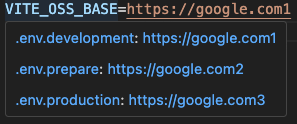

# vscode-dot-preview

show `dot env` files config info when U `hover` on the config `KEY`

And it will help u to jump to the config file when U click the `Hover Message`

## config
```javascript
{
  "dotpreview.prefix": [
    ".env"
  ],
  "dotpreview.env": [
    "prepare",
    "uat"
  ],
  // will skip these files/dirs when scan project dir
  "dotpreview.scanExclude": [
    "src",
    "__test__"
  ],
}
```

## example 


## License

[MIT](./LICENSE) 